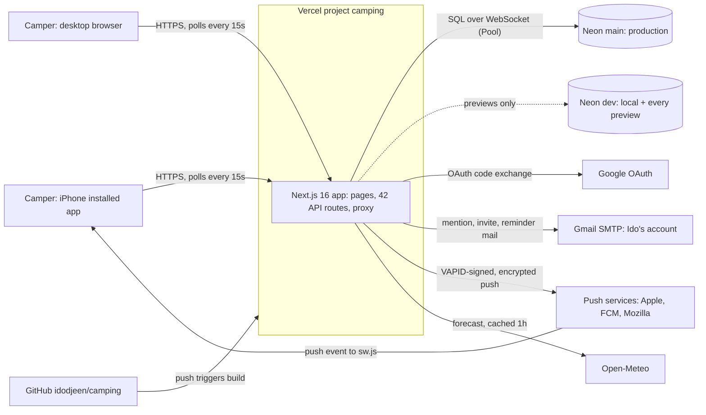
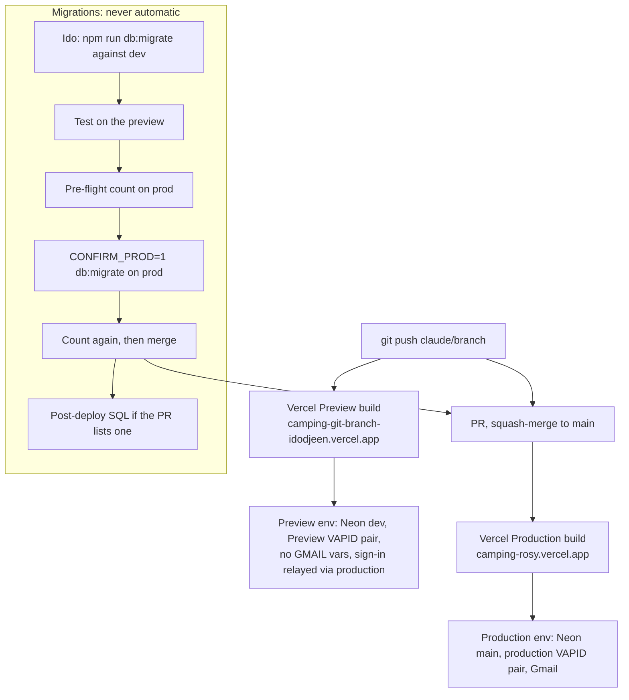
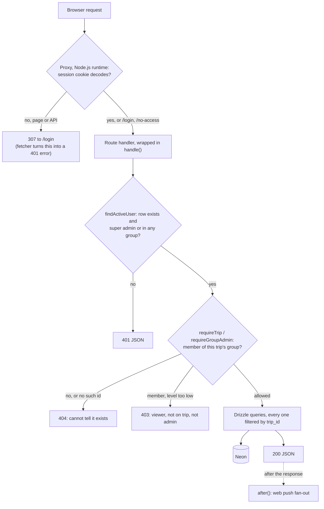
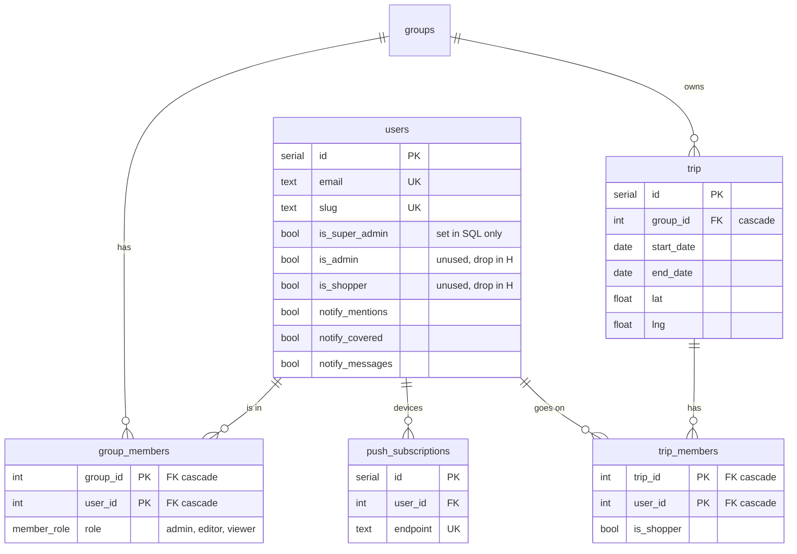
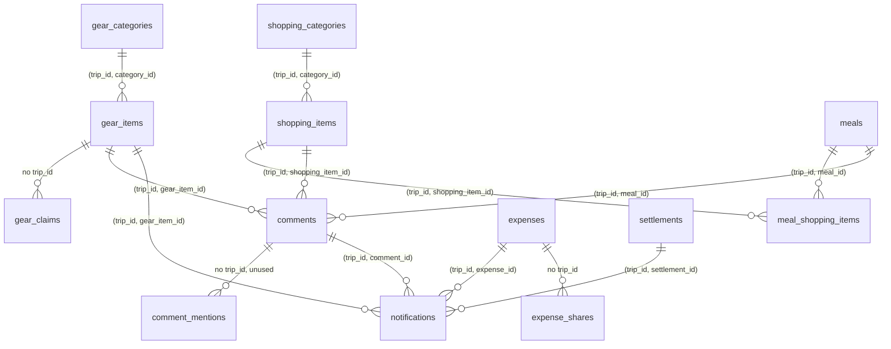
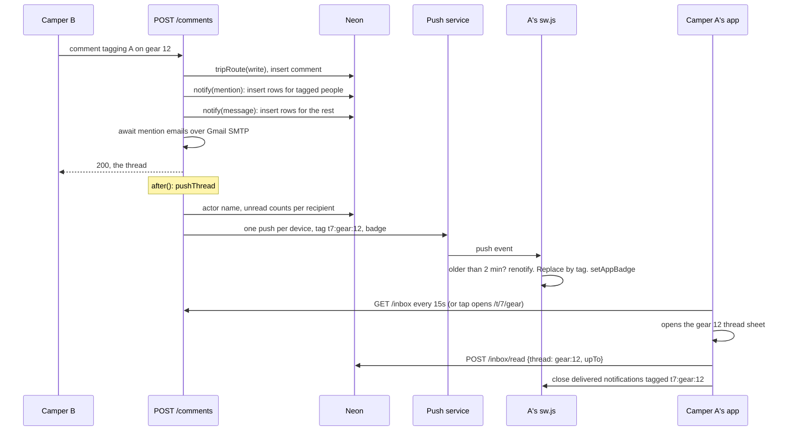
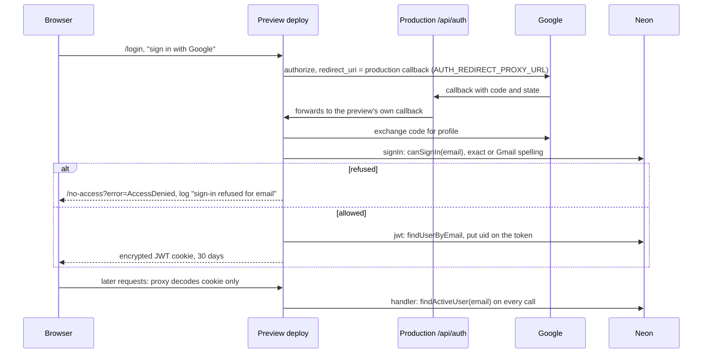
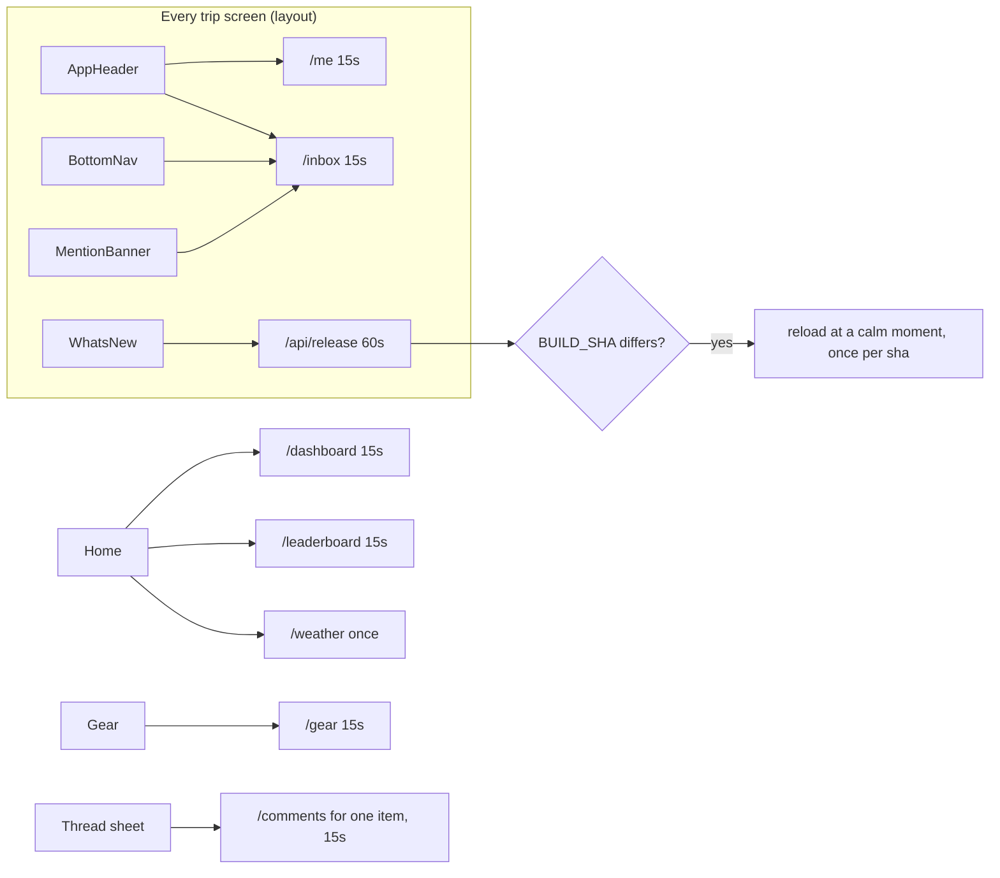

# Architecture

> Written 2026-10-08 against `origin/main` at `4a07191` (#18): groups phases 1-6 and roadmap A-E live,
> 13 migrations. Every statement cites the code as `path:line`. Where this disagrees with
> `docs/architecture-handoff.md` or older docs, the code wins; the differences are listed at the end.
> The open questions carry recommendations for Ido to decide; nothing here changes code.

## In one paragraph

One Next.js 16 app on Vercel, one Neon Postgres database per environment, and nothing else running:
no cron, no queue, no worker. `vercel.json` holds only the rule that skips production builds for
docs-only commits (`scripts/vercel-ignore.sh`). Every request passes the proxy (a cookie check, no
database), then a route handler that re-reads the person and their role from the database
(`src/lib/access.ts:73`). Screens stay fresh by polling every 15 seconds (`src/lib/api.ts:57`).
The only work done after the response is web push, through `after()` (`src/lib/notifications.ts:193`).
Email goes out from Ido's Gmail over SMTP, inside the request that caused it.

## 1. System context

What to notice:
- Every arrow out of the app starts inside a request. Push is the only one that can finish after
  the response (`after()`, `src/lib/notifications.ts:196`); mail is awaited inside the request
  (`src/app/api/t/[tripId]/comments/route.ts:51`, `src/lib/invite-email.ts:47`).
- The Pool driver, not neon-http, because gear claims need `SELECT ... FOR UPDATE` in a real
  transaction (`src/db/index.ts:7-10`, `src/lib/gear.ts:36`).
- Open-Meteo is fetched with `next: { revalidate: 3600 }`, so one response serves every caller for
  an hour (`src/lib/weather.ts:42`), and the client never polls it (`src/components/weather-card.tsx:16`).
- No photos service is wired: `CLOUDINARY_*` exist on Vercel Production but nothing in `src/` reads them.

Checked against: `src/db/index.ts`, `src/lib/weather.ts`, `src/lib/mailer.ts`, `src/lib/push.ts`,
`src/lib/notifications.ts`, `src/auth.config.ts`, `next.config.ts`, `vercel env ls` (names only).

## 2. Environments and deploys

What to notice:
- No build step touches a database. Migrations run by hand from a laptop through
  `scripts/db-migrate.mjs`, which refuses production unless `CONFIRM_PROD=1`
  (`scripts/prod-guard.mjs:55-58`) and refuses everything when `PROD_DB_HOST` is unset (`:50-53`).
- Because migrations are expand-only, the old deploy keeps running correctly between step M4 and
  the merge. The roadmap's flowchart (`docs/roadmap.md`, "Deploying a migration") still holds.
- Preview and Production share `AUTH_SECRET` (needed for the sign-in relay), so a session cookie
  minted for a preview is also valid on production. See question 10.
- `deploymentId` (`next.config.ts:14`) and `BUILD_SHA` (`next.config.ts:6`) are how an open tab
  learns it runs an old deploy (diagram 7).

Checked against: `scripts/db-migrate.mjs`, `scripts/prod-guard.mjs`, `.env.example`, `next.config.ts`,
`vercel env ls`, `docs/handoff.md` (Migrations).

## 3. A request's path

What to notice:
- The proxy is the database-free half of the auth config (`src/proxy.ts:5-7`, `src/auth.config.ts:33-37`).
  In Next 16 the proxy runs on the Node.js runtime, not the Edge (`node_modules/next/dist/docs/01-app/03-api-reference/03-file-conventions/proxy.md`, "Runtime").
  Its matcher skips auth routes, static assets and `sw.js` (`src/proxy.ts:12`).
- An expired session on an API call is a redirect that `fetch` follows to the login page's HTML;
  `fetcher` detects `res.redirected` and reports 401 instead of an empty object (`src/lib/api.ts:24-29`).
- Every request re-reads the person (`src/lib/session.ts:15-20`, `src/lib/user.ts:43-56`), so removal
  from the last group takes effect on the next request, despite 30-day JWTs.
- 404 for outsiders, 403 for members who lack the level (`src/lib/access.ts:78-86`, `:135-136`).
  Pages do the same through `notFound()` (`src/app/(app)/t/[tripId]/layout.tsx:37`).
- `/api/release` and `/api/version` have no handler-level check: only the proxy's cookie check
  guards them, so a removed person with a live cookie still gets 200 (`src/app/api/release/route.ts:12`,
  `src/app/api/version/route.ts:13`). Both return deploy metadata only.
- Super-admin routes use `requireSuperAdmin()` (`src/lib/session.ts:45-49`); admin reminders check
  `isSuperAdmin` after a read-level `tripRoute` (`src/app/api/t/[tripId]/admin/notify/route.ts:22-26`).

Checked against: `src/proxy.ts`, `src/auth.config.ts`, `src/lib/session.ts`, `src/lib/access.ts`,
`src/lib/user.ts`, `src/lib/api.ts`, every `route.ts` under `src/app/api/` (each trip route's first
call is `tripRoute(ctx, level)`).

## 4. Data model

20 tables (`src/db/schema.ts`), two Postgres enums (`meal_slot`, `member_role`); notification kinds
are `text` plus a CHECK (`src/db/schema.ts:391-411`).

### 4a. People and access

### 4b. A trip's content

Every table below has `trip_id NOT NULL REFERENCES trip ON DELETE CASCADE` with no default
(`src/db/schema.ts:158-161`), except the three marked "no trip_id", which are scoped through
their parent. "(trip_id, x_id)" marks a composite foreign key: the database refuses a link to a
row in another trip.

Not drawn: `personal_items` (trip_id plus user_id, plain FKs), and `notifications`'
`(trip_id, shopping_item_id)` link, to stay under the node limit.

What to notice:
- All composite keys cascade, so deleting an item takes its comments, and deleting a comment takes
  its bell rows (`src/db/schema.ts:347-363`, `:471-495`). Deleting a meal reaches notifications through
  its comments (`:421-422`).
- A comment has at most one subject; none means the general chat (`src/db/schema.ts:342-345`).
- `gear_claims`, `expense_shares` and `comment_mentions` carry no `trip_id`. Claims are scoped by
  checking the item first (`src/lib/gear.ts`, `assertGearItem`, and the locked select at `:32-36`).
- `comment_mentions` is no longer read or written anywhere outside the schema; `notifications` holds tags
  since 0011/0012.
- Money is integer agorot with CHECKs on positive amounts (`src/db/schema.ts:543-545`, `:574`, `:619-620`).

Checked against: `src/db/schema.ts`, `drizzle/0011_unify_notifications.sql`, `src/lib/gear.ts`.

## 5. A notification, end to end

What to notice:
- Two `notify()` calls per comment: tags to the tagged, plain messages to everyone else who hears
  messages (`src/lib/comments.ts:153-166`). Recipients are the trip's people minus the actor and
  minus viewers (`src/lib/notifications.ts:96-116`).
- Rows are written before the response; pushes go out in `after()` and never fail the action
  (`src/lib/notifications.ts:151-187`). The counts are read after the insert, so the push says
  "3 חדשות" correctly (`:208-253`).
- Mention emails are not deferred: the handler awaits sequential SMTP sends before replying
  (`src/app/api/t/[tripId]/comments/route.ts:41-55`, `src/lib/mailer.ts:53-60`), hence `maxDuration = 60`.
- Only three kinds are written today: `mention`, `message` (`src/lib/comments.ts:153,158`) and
  `covered` (`src/lib/gear.ts:89`). The other nine in the CHECK wait for roadmap F.
- A tap opens the screen, not the sheet: the push URL is `/t/<trip><page>` without the item
  (`src/lib/notifications.ts:237`). The item's id is in the tag, not the URL.
- Pushes use `TTL` 24 hours and `urgency: normal`, with no `Topic` header (`src/lib/push.ts:106`).
  Dead endpoints (404/410) are deleted (`:110`, `:117-119`); the app re-posts its subscription on
  every launch (`src/components/push-sync.tsx:11-15`, `src/lib/push-client.ts:54-67`).

Checked against: `src/lib/comments.ts`, `src/lib/notifications.ts`, `src/lib/push.ts`,
`src/lib/threads.ts`, `public/sw.js`, `src/lib/inbox-client.ts`, `src/lib/push-client.ts`,
`src/app/api/t/[tripId]/comments/route.ts`, `src/app/api/t/[tripId]/inbox/read/route.ts`.

## 6. Sign-in

What to notice:
- On production the relay steps disappear: Google calls production's own callback.
- The gate is the database: a super admin, or anyone in at least one group (`src/lib/user.ts:65-78`).
  Gmail addresses match across dots, `+tags` and googlemail.com (`src/lib/user.ts:9-26`). A refusal is
  logged with the address (`src/auth.ts:16-24`).
- One leftover path: an address on `VIEWER_USERS` with no row is imported as a viewer of group 1
  (`src/lib/user.ts:84-108`). Phase 7 removes it.
- The token holds the user id only, never a role (`src/auth.ts:26-39`); roles are read per request.
- `trustHost: true` is set in code, so `AUTH_TRUST_HOST` on Vercel is redundant (`src/auth.config.ts:26`).

Checked against: `src/auth.ts`, `src/auth.config.ts`, `src/lib/user.ts`, `src/lib/session.ts`,
`src/proxy.ts`, `.env.example` (AUTH_REDIRECT_PROXY_URL).

## 7. Client data flow

What to notice:
- SWR deduplicates by key, so the header, nav, banner and bell share one `/inbox` request per poll
  (`src/lib/inbox-client.ts:41-54`), and every `/me` user shares one too.
- Polling pauses when the tab is hidden: `swrConfig` doesn't set `refreshWhenHidden`
  (`src/lib/api.ts:57-62`), and SWR's default is off. Focus triggers an immediate refetch.
- Other screens follow the gear pattern with their own key: `/shopping`, `/meals`, `/chat`,
  `/chat?room=general`, `/expenses`, `/leaderboard`, `/manage` (no interval, focus only,
  `src/components/trip-manage.tsx:42-46`). `/admin` and `/g/[groupId]` refetch on focus only.
- The reload guard compares the bundle's `BUILD_SHA` with `/api/release` and reloads once per sha,
  never over typed text (`src/lib/reload-guard.ts:25-55`, `src/components/whats-new.tsx:43-63`).
  `deploymentId` already turns navigations across a deploy into full loads (`next.config.ts:11-14`).

Checked against: `src/lib/api.ts`, `src/lib/inbox-client.ts`, `src/lib/reload-guard.ts`,
`src/components/whats-new.tsx`, `src/app/(app)/t/[tripId]/layout.tsx`, `grep useSWR src/`.

## Open questions

Cost: S is under a day, M a few days, L a week or more.

### 1. Nothing runs on a schedule

**Today.** No cron route (`vercel.json` has only the docs-only build rule). Reminders are previewed and sent by hand by the super
admin, as sequential SMTP sends inside the request (`src/app/api/t/[tripId]/admin/notify/route.ts:50-66`).
Notification rows are never pruned.

**Recommendation.** Not yet for reminders: the trip cadence is a few times a year and a human
choosing the moment is a feature. Add one Vercel Cron later, when F lands reminders as push, for two
jobs: a pre-trip reminder (T-3 days) and a nightly prune of read notification rows older than 90 days.
It needs a `CRON_SECRET` checked on the route, idempotency (a `reminder:<type>` thread key per trip
and day already exists in `src/lib/threads.ts:23`, so a unique index or a "sent today?" query covers it),
and the job must use `notify()`, not a new path. **Cost: M.**

### 2. Polling

**Today.** One open trip screen polls `/inbox`, `/me` and its own list every 15s, plus `/api/release`
every 60s. The home screen adds `/dashboard` and `/leaderboard`. That is about 780 requests per hour
on the gear screen and about 1,020 on home, per visible tab. Each request costs two queries before
the handler (`findActiveUser`, `loadTripAccess`); `/inbox` adds four to ten (`src/lib/notifications.ts:479-499`),
`/me` about four (`src/app/api/t/[tripId]/me/route.ts`).

**Estimate.** 10 campers with the app open 1 hour a day is about 300,000 function invocations and
about 2 million queries a month. Two cost effects: Vercel invocations and CPU time, and Neon compute
that cannot scale to zero while anyone has the app open. Compare those to the plans' included usage on
both dashboards; the code can't tell which plan is in use.

**Recommendation.** Keep polling; SSE or a realtime service doesn't pay off before about 100
concurrently open apps, and long-lived connections on serverless functions are billed for their whole
duration. Cheaper steps first: (a) poll `/me` at 60s, since it changes rarely and every write already
calls `mutate`; (b) poll lists at 30s and keep `/inbox` at 15s, which carries the "something changed"
signal; (c) drop the `unreadMentions` adapter from `/me` in H. Together about 40% fewer requests.
**Cost: S.**

### 3. Email from a personal Gmail

**Today.** Nodemailer with an app password (`src/lib/mailer.ts:19-37`), sequential sends
(`:53-60`), awaited inside the request for mentions and invites. A changed Google password revokes
app passwords: every send then fails, is logged as `mention email failed` / `invite email failed`,
and the action still succeeds. Previews have no `GMAIL_*`, so they never send.

**Recommendation.** Two steps. Now: move mention emails into `after()` like push, so a comment with
`@כולם` doesn't wait on several SMTP handshakes (**S**). Later: move to a transactional provider on
a domain of the app's own (SPF, DKIM, DMARC) when any of these happens: a second sender is needed
(group admins sending reminders), more than about 20 groups, or bounces start. Gmail's consumer
sending limit is on the order of 500 recipients a day, and bulk-looking mail from a personal account
risks the account itself. The change is local: `getTransport()` and `sendAll()` (**M**, mostly DNS).

### 4. Keeping groups apart

**Today.** Three layers: the gate per request (`src/lib/access.ts:73-88`), every query filtered by
the gate's trip, and composite keys (diagram 4b). RLS left out on purpose (`docs/groups-and-trips.md`,
"Keeping groups apart"). All 29 trip route files start with `tripRoute(ctx, level)`.

**Revisit when** any of these is true: sign-up opens to the public; someone other than Ido (or
reviewed agents) writes routes; a reporting tool or a person gets direct SQL access; a bug is found
where a query missed its trip filter; or a table scoped only through a parent (`gear_claims`,
`expense_shares`) gains its own write path.

**Recommendation.** Keep the design. Add a cheap guard instead of RLS: a typecheck-time or CI
check that every `route.ts` under `api/t/[tripId]` calls `tripRoute` first. **Cost: S.**

### 5. One shared `dev` database

**Today.** Local work and every preview use `dev` (`DATABASE_URL` on Preview and Development). It was
branched from production, so it holds real people's emails and their push subscriptions
(`.env.example`, VAPID section); that is why previews have their own VAPID pair and no Gmail.

**Recommendation.** Keep one `dev` while only one migration PR is open at a time. Per-branch Neon
branches become worth it when two migration PRs must be tested side by side, or when two sessions'
test rows start colliding. The Neon integration's `check_env_*` variables suggest the integration is
installed but not used for branching. Separately, consider resetting `dev` from an anonymized copy,
since every real camper can sign in to a preview. **Cost: M** (per-branch), **S** (anonymize once).

### 6. Production migrations are manual

**Today.** Pre-flight count, `CONFIRM_PROD=1 npm run db:migrate`, count again, merge
(`docs/handoff.md`, Migrations). The guard is solid (`scripts/prod-guard.mjs:50-58`).

**Recommendation.** Keep it manual: migrations land about once a week and each needs a human to
read the generated SQL (drizzle-kit has emitted a foreign key before its unique key, see the comment
at the top of `drizzle/0011_unify_notifications.sql`). Running them in the Vercel build would also
run them on retries and redeploys, and would need its own `VERCEL_ENV` guard. One improvement: a
single `npm run db:migrate:prod` that does pre-flight, migrate and compare in one go, from the PR's
worktree. Revisit CI (a GitHub Action with a protected environment and manual approval) if migrations
become frequent. **Cost: S** (script), **M** (CI).

### 7. Backups and recovery

**Today.** Nothing in the repo; recovery relies on Neon's point-in-time restore, whose window depends
on the Neon plan (Settings, history retention).

**Recommendation.** Before H's drops: create a named Neon branch of `main` right before running the
migration (instant, copy-on-write, and the restore path if a drop was wrong), and keep it for a
month. Also confirm the history window today and write it into `docs/handoff.md`. **Cost: S.**

### 8. Observability

**Today.** 13 `console.*` calls outside the seed script; the server ones go to Vercel logs. Client errors are logged in the
browser only (`src/components/widget-boundary.tsx`, `src/components/error-card.tsx`) and never reach
the server. Push failures log the status and message (`src/lib/push.ts:111`), not which user or how
many; sign-in refusals log the address (`src/auth.ts:22`).

**Recommendation.** Sentry's free tier is worth it once there are several groups, mainly for the
client errors nobody sees today (**M**). Before that: one log line per fan-out with counts
(`push sent=5 gone=1 failed=0 kind=mention trip=7`), the same for mail (`mail sent=3 failed=1`), and a
tiny endpoint that client error boundaries post to (**S**).

### 9. Push reliability

**Today.** Tagged replacement and the 2-minute renotify rule (`public/sw.js:14-23`), badge on the
icon (`:26-34`), a visible notification for every push as Safari requires (`:36-37`), pruning of
404/410 (`src/lib/push.ts:110`), and re-posting the subscription on every launch.

**Missing:**
- A `pushsubscriptionchange` handler in `sw.js`: a rotated subscription only comes back on the next
  launch.
- A `Topic` header: a phone that was offline gets every queued push for a thread instead of the
  newest. `web-push` supports `topic`, but topics allow only 32 URL-safe base64 characters, so the
  tag (`t7:gear:12`) needs encoding (`src/lib/threads.ts:66`).
- A tap opens the list, not the thread (`src/lib/notifications.ts:237`). Adding the item to the URL
  (`?thread=gear:12`) and opening the sheet from it would match what the bell does.
- iOS ignores `renotify`, so a replacement arrives silently there (`public/sw.js:11-12`). Nothing to
  fix, but the phone checklist should expect it.

**Cost: S** each.

### 10. Secrets and configuration

**Today, from `vercel env ls`:** the rule "Secret never reaches the runtime, use Config" is in
`src/lib/mailer.ts:12-15`, `src/lib/push.ts:13-14` and `.env.example`. But on Production,
`GMAIL_USER`, `GMAIL_APP_PASSWORD`, `VAPID_PUBLIC_KEY`, `VAPID_PRIVATE_KEY`, `VAPID_SUBJECT`,
`VIEWER_USERS` and `AUTH_TRUST_HOST` are listed as **Secret**. Either production push and email work,
and the rule is wrong, or they are silently broken in production. **Ido: did a mention email or a
push arrive from production recently?** `/api/version` can settle it in one deploy by reporting
presence booleans for `GMAIL_*` and `VAPID_*` (`src/app/api/version/route.ts:25-32`).

**Sensitive:** `AUTH_SECRET` (forges a session as anyone, the super admin included),
`DATABASE_URL`, `GMAIL_APP_PASSWORD` (sends as Ido), `VAPID_PRIVATE_KEY`, `AUTH_GOOGLE_SECRET`,
`CLOUDINARY_API_SECRET` (unused). **Not sensitive:** `VAPID_PUBLIC_KEY`, `AUTH_GOOGLE_ID`,
`AUTH_URL`, `AUTH_REDIRECT_PROXY_URL`, `VAPID_SUBJECT`.

**Recommendation.** Config for everything is acceptable while Ido is the only person on the Vercel
team. Two follow-ups: remove the unused variables (`CLOUDINARY_*`, `ALLOWED_USERS` on Vercel, which
only the seed and `/api/version` read, `AUTH_TRUST_HOST`, the `check_env_*` set), and know that a
shared `AUTH_SECRET` means any pushed branch's code can mint production sessions. **Cost: S.**

### 11. Scale

At **10 groups** (about 60 people): nothing breaks. The single super admin is the first friction:
only Ido can send reminders (`src/app/api/t/[tripId]/admin/notify/route.ts:24`) and create groups.

At **100 groups** (about 600 people, maybe 50 open at once):
1. **Gmail** first: invites for 100 groups plus `@כולם` mentions pass the daily limit, and slow
   SMTP inside requests stretches comment posts (question 3).
2. **Polling cost**: about 50,000 requests an hour at peak, about 150,000 queries; still fine for
   Neon, but no longer free on Vercel (question 2).
3. **Notification rows** grow by recipients times events, never pruned (question 1).
4. **The shared `dev` database** isn't affected by users; it's affected by parallel sessions.

### 12. Temporary code (H)

Confirmed, all still present on `main`:
- `src/app/api/[...legacy]/route.ts` (pre-trip paths).
- #20's adapters: `GET/POST/PATCH /api/t/[tripId]/notifications`, `POST .../comments/read`,
  `POST .../chat/read`, `unreadMentions` in `/me` (`src/app/api/t/[tripId]/me/route.ts:57-58`), and
  their helpers (`src/lib/notifications.ts:536-600`).
- `comment_mentions`: no reader or writer outside `src/db/schema.ts`.
- `users.is_admin`, `users.is_shopper`: no code reads the columns (the `isAdmin` in API responses is
  `access.isAdmin`).
- `notifications.thread_key` nullable, with the `row:<id>` fallback (`src/lib/notifications.ts:88-89`).
- `VIEWER_USERS` and `importEnvViewer` (phase 7, `src/lib/user.ts:80-108`).
- **Add:** `ALLOWED_USERS` in `/api/version` (`src/app/api/version/route.ts:19,31,45-48`), and the
  unused Vercel variables in question 10.

**Order:**
1. One code-only PR: delete the legacy route, the adapters and their helpers, the fallback readers,
   and stop selecting the dropped columns. Deploy it.
2. Wait one release, so no open tab still calls the old paths.
3. Snapshot `main` (question 7), backfill any null `thread_key`, set it NOT NULL, then drop
   `comment_mentions`, `users.is_admin`, `users.is_shopper` in one migration.
4. Remove the Vercel variables.

**Cost: M.**

## Corrections to the brief's inventories

| Brief says | The code and Vercel say |
|---|---|
| 19 tables | 20 (`grep -c pgTable src/db/schema.ts`) |
| The proxy at the Edge (diagram 3) | Node.js runtime, the Next 16 default for `proxy.ts` |
| `/api/release`, `/api/version`: signed in | Only the proxy's cookie check; no active-user check in the handler |
| Push sends since #20 run in `after()` | True, and nothing else does: mention and invite emails are awaited in the request |
| VAPID and Gmail are Config on Vercel | Production's `GMAIL_*`, `VAPID_*`, `VIEWER_USERS`, `AUTH_TRUST_HOST` are Secret (question 10) |
| `DATABASE_URL` per environment, `dev` for previews | Also set for Vercel's Development environment (`vercel env pull`) |
| Not listed | `AUTH_URL` on Production: the link in every email (`src/lib/emails.ts:22`) |
| Not listed | `ALLOWED_USERS` still on Production and Preview; read only by the seed and `/api/version` |
| `notify()` and the 12-kind CHECK | Only `mention`, `message`, `covered` are written today |
| `requireTrip` in `src/lib/session.ts` (`docs/groups-and-trips.md`) | `src/lib/access.ts:73` |
| `maxDuration` not mentioned | 60s on six routes that send mail or forward: comments, chat, admin/notify, admin/groups, g/members, legacy |

The 42 route files and their methods match the brief's API table.
