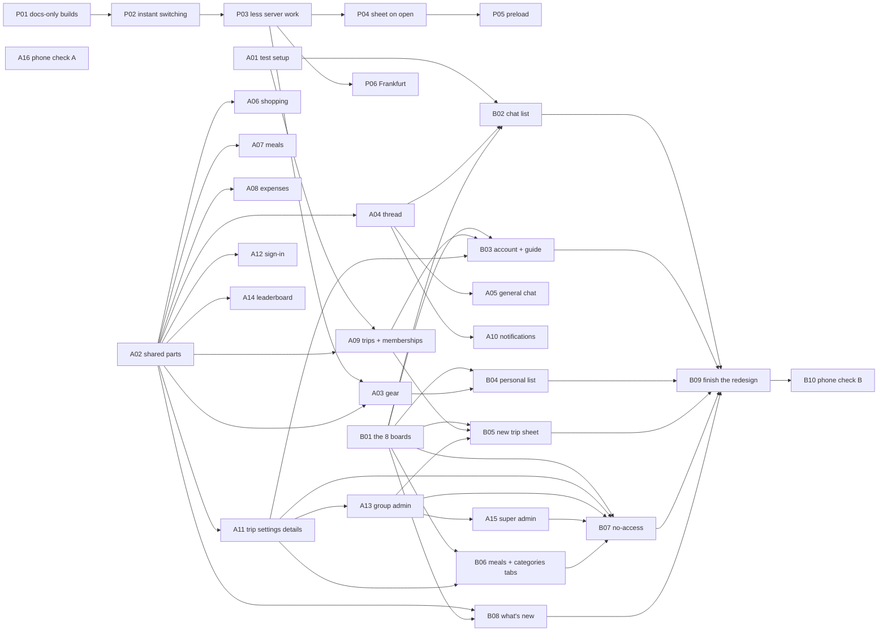

# Roadmap: the redesign sprint

> Planned 2026-10-09 in a grilling session (35 decisions), then turned into two specs and 26 tickets.
> Starts after PR #25 (design system, light and dark, new home), groups phase 7 and roadmap F, G and H.
> Words: `GLOSSARY.md`. Decisions: `docs/adr/`. Design rules: `CLAUDE.md` (from PR #25).

## The specs

| Spec | What it delivers | Tickets |
|---|---|---|
| **P. Perf sprint** ([spec](../.scratch/perf-sprint/spec.md)) | Screens switch without waiting for the server, the server does less per request, then the move to Frankfurt. Runs before A03, so the screens are rebuilt on the faster base | [P01-P06](../.scratch/perf-sprint/issues/) |
| **A. Redesign rollout** ([spec](../.scratch/redesign-rollout/spec.md)) | Every screen that has a board on the design canvas, rebuilt to it in light and dark from shared parts. Look only, with three agreed exceptions: gear chips, trips grouped by group and phase, reminders moved to trip settings | [A01-A16](../.scratch/redesign-rollout/issues/) |
| **B. New screens** ([spec](../.scratch/new-screens/spec.md)) | Boards for the 8 screens that have none, then: chat list, account and guide, personal list, new trip sheet, meals and categories tabs, no-access, what's new. Ends by deleting the old colour bridge | [B01-B10](../.scratch/new-screens/issues/) |

## Status

This table is the sprint's tracker. **Every ticket's PR updates its own row**: `claimed` with the branch
when work starts, the PR link when it opens, and `done <date>` in the PR itself so it lands with the
merge. The ticket file's own `Status:` line follows the same steps (`docs/agents/issue-tracker.md`). If two PRs
touch neighbouring rows, whoever merges second keeps both rows when syncing with `main`.

| Ticket | Status | Branch / PR | Notes |
|---|---|---|---|
| [A01 Test setup](../.scratch/redesign-rollout/issues/01-test-setup.md) | ready-for-agent | | |
| [A02 Shared design parts and states](../.scratch/redesign-rollout/issues/02-shared-design-parts.md) | ready-for-agent | | P02 also touches the filter chips and the side sheet: whichever merges second syncs with `main` |
| [P01 Production skips docs-only commits](../.scratch/perf-sprint/issues/01-skip-docs-builds.md) | done 2026-10-10 | [#32](https://github.com/idodjeen/camping/pull/32) | |
| [P02 Instant switching](../.scratch/perf-sprint/issues/02-instant-switching.md) | done 2026-10-10 | [#34](https://github.com/idodjeen/camping/pull/34) | [#33](https://github.com/idodjeen/camping/pull/33) merged into #32's branch, not `main`; #34 is the same code |
| [P03 Less server work per request](../.scratch/perf-sprint/issues/03-less-server-work.md) | ready-for-agent | | Then measure P01-P03 and report to Ido |
| [P04 Comment sheet only when opened](../.scratch/perf-sprint/issues/04-comment-sheet-on-open.md) | blocked: P03 and the measure step | | Merge after #31 (both touch `comments.tsx`) |
| [P05 Other tabs' data in the background](../.scratch/perf-sprint/issues/05-preload-other-tabs.md) | blocked: P04 | | |
| [P06 Move to Frankfurt](../.scratch/perf-sprint/issues/06-frankfurt-move.md) | blocked: P03 and the measure step | | Ido runs the production database steps and gives each go |
| [A03 Gear](../.scratch/redesign-rollout/issues/03-gear.md) | blocked: A02, P03 | | |
| [A04 Item thread](../.scratch/redesign-rollout/issues/04-item-thread.md) | blocked: A02 | | |
| [A05 General chat](../.scratch/redesign-rollout/issues/05-general-chat.md) | blocked: A02, A04 | | |
| [A06 Shopping](../.scratch/redesign-rollout/issues/06-shopping.md) | blocked: A02 | | |
| [A07 Meals](../.scratch/redesign-rollout/issues/07-meals.md) | blocked: A02 | | |
| [A08 Expenses and the new expense pop-up](../.scratch/redesign-rollout/issues/08-expenses.md) | blocked: A02 | | |
| [A09 Trips, memberships and the trip switcher](../.scratch/redesign-rollout/issues/09-trips-and-memberships.md) | blocked: A01, A02 | | |
| [A10 Notifications](../.scratch/redesign-rollout/issues/10-notifications.md) | blocked: A02, A04 | | |
| [A11 Trip settings details and the reminder card](../.scratch/redesign-rollout/issues/11-trip-settings-details.md) | blocked: A02 | | |
| [A12 Sign-in](../.scratch/redesign-rollout/issues/12-sign-in.md) | blocked: A02 | | |
| [A13 Group admin](../.scratch/redesign-rollout/issues/13-group-admin.md) | blocked: A02, A11 | | |
| [A14 Leaderboard](../.scratch/redesign-rollout/issues/14-leaderboard.md) | blocked: A02 | | |
| [A15 Super admin](../.scratch/redesign-rollout/issues/15-super-admin.md) | blocked: A02, A13 | | |
| [A16 Real-phone check, rollout](../.scratch/redesign-rollout/issues/16-phone-check.md) | blocked: A03-A15 | | |
| [B01 Draw the 8 boards](../.scratch/new-screens/issues/01-boards.md) | ready-for-agent | | |
| [B02 Chat list](../.scratch/new-screens/issues/02-chat-list.md) | blocked: B01, A01, A02, A04 | | |
| [B03 Account, guide and menu](../.scratch/new-screens/issues/03-account-and-guide.md) | blocked: B01, A09, A11 | | |
| [B04 Personal list](../.scratch/new-screens/issues/04-personal-list.md) | blocked: B01, A03 | | |
| [B05 New trip sheet](../.scratch/new-screens/issues/05-new-trip-sheet.md) | blocked: B01, A09, A13 | | |
| [B06 Meals and categories tabs](../.scratch/new-screens/issues/06-meals-and-categories-tabs.md) | blocked: B01, A11 | | |
| [B07 No-access](../.scratch/new-screens/issues/07-no-access.md) | blocked: B01, A11, A13, A15, B06 | | |
| [B08 What's new](../.scratch/new-screens/issues/08-whats-new.md) | blocked: B01, A02 | | |
| [B09 Finish the redesign](../.scratch/new-screens/issues/09-finish-the-redesign.md) | blocked: A03-A15, B02-B08 | | |
| [B10 Real-phone check, new screens](../.scratch/new-screens/issues/10-phone-check.md) | blocked: B02-B09 | | |

Statuses: `ready-for-agent`, `blocked: <tickets>`, `claimed`, `PR open`, `done <date>`, `dropped`. When a
ticket merges, flip the rows it unblocks to `ready-for-agent`. Decisions that change the plan go in the spec (and
an ADR if they qualify), and a line under **Changes** below.

## Changes

- 2026-10-09: planned. 35 decisions in the grilling session; ticket blocks adjusted after a code check
  (shared files between screens, and the new meal pop-up moved to B06).
- 2026-10-10: Spec P (perf sprint, P01-P06) added before A03, from the screen-switching analysis. A03 now
  also waits for P03. Order: P01, P02, P03, measure and report to Ido, then P04, P05, P06.
- 2026-10-10: P01 merged (#32). P02's #33 was stacked on #32 and merged into #32's branch, so #34
  brings the same code to `main`.

## Order



(B09 also waits on every Spec A screen ticket; A16 waits on A03-A15. Both left out of the drawing.)

- **Perf first:** P01, P02 and P03 in that order, then the measure step, before A03 starts. A01, A02 and
  B01 can run alongside: none of them waits on anything.
- **Up to three** screen tickets at once, each in its own worktree. No ticket has a migration.
- **Priority when choosing** among ready tickets: A follows gear, thread, general chat, shopping, meals,
  expenses, trips, notifications, trip settings, sign-in, group admin, leaderboard, super admin. B starts
  with the chat list, then account and guide.
- **Pop-ups:** Spec A PRs carry `[no-popup]`. Spec B PRs have Hebrew titles. B09 ships the "new look" note.

## How to run a ticket

One ticket per session, in a worktree off `origin/main` (never the shared checkout):

```text
/implement .scratch/<spec>/issues/<NN>-<slug>.md
```

Before merging: `/spec-review main` on the branch. B01 is a design session on the canvas, not `/implement`:

```text
Repo /Users/idodwek/camping. Do ticket B01 in .scratch/new-screens/issues/01-boards.md: draw the 8 missing boards, light and dark, on the design canvas linked in CLAUDE.md, following the design system linked there and Spec B (.scratch/new-screens/spec.md). Read the existing boards first and reuse their parts. Stop after each board for Ido's approval.
```

## Later

| Item | Why it waits |
|---|---|
| **Spec C: self-serve groups**: the "new group or join" board, invite links and codes, open sign-in | A feature of its own: open sign-in, a new table, abuse rules, and a different meaning for the no-access page |
| **Chat extras**: activity lines in the chat, list cards in messages | New kinds of message; they overlap with the notification kinds from F |
| **Typing indicator, read ticks** | Need a live connection; the app refreshes every 15s |
| **A read marker per person per thread** | Would give unread counts on threads you don't follow; needs a table |
| **Trips without dates** | Needs a migration and changes to the countdown and meals |
| **Real 403 status on admin pages** | Needs `experimental.authInterrupts`; only the card changes in B07 |
