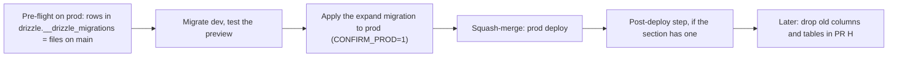
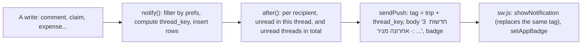
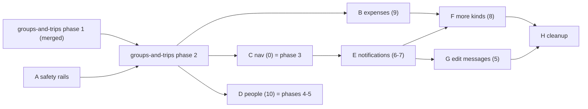

# Roadmap: items 0-10

> Planned on Oct 6, 2026 from `docs/roadmap-input.md`, `REPO-STATUS-2026-09-29.md`, the code on `main`
> (`f2da2a2`), the Vercel environment and your answers. The trip is over, so the merge freeze no longer
> applies. Planning only: nothing here is built.

## Overview

### Where this fits with `docs/groups-and-trips.md`

`docs/groups-and-trips.md` (agreed Oct 6) turns the app into many groups with many trips. Its phase 1
is on `main` since [PR #5](https://github.com/idodjeen/camping/pull/5): migration `0008_groups_and_trips`
adds groups, trip members, and `trip_id` with composite foreign keys on every content table
(`DEFAULT 1` for now, so today's code keeps inserting unchanged). It goes first, and this roadmap
follows its rules:

- **Item 0 is its phase 3.** Section 0 below is the detailed design for that phase.
- **Item 10 is its phases 4-5.** Section 10 lists what those phases must also check.
- **Items 5, 6-7 and 8 come after its phase 3** and are built trip-aware: `requireTrip()` instead of
  `requireUser()`, `trip_id` on new rows, routes under `/api/t/[tripId]/`, mentions resolved against
  the trip's people. Each section says what that changes.
- **Item 9 comes right after phase 2.** Phase 2 is being built now, and it moves the expense routes to
  `/api/t/[tripId]/expenses` and generates the next migration (it drops `users.is_admin`,
  `users.is_shopper` and the temporary `DEFAULT 1`). Item 9 before it would collide on both. Right
  after it, item 9 is the first feature on the new routes, and still useful for settling this trip.

### Scope

| # | Item | Decision | Group |
|---|---|---|---|
| 0 | Navigation | Build as groups-and-trips phase 3: sticky header, menu button, bell on every screen | C |
| 1 | Photos in chat | Deferred ("skip for now") | - |
| 2 | Android push | Dropped as an item; two platform-neutral parts move into E | - |
| 3 | Music for the video | Dropped (separate repo, trip is over) | - |
| 4 | Carpool | Dropped (trip is over) | - |
| 5 | Edit messages | Build | G |
| 6-7 | Collapse notifications, read state | Build, one table | E |
| 8 | More kinds of notifications (new) | Build: all seven events, four switches | F |
| 9 | Expenses: edit and charts (new) | Build | B |
| 10 | Admin page for people (new) | Build as groups-and-trips phases 4-5 | D |

Already on `main` for item 7: "mark all read" clears both tables, tapping a message or "covered" row
marks it read, and opening a thread or the room marks its tags read. Section 6-7 builds on that.

### Why items 0-2 broke, and what changes

You described "major bugs I couldn't handle". The reverted code doesn't say which bug came from where,
but it shows four ways a small mistake becomes app-wide breakage. Every group below is built around them.

1. **Three features in one PR.** #2 shipped nav, photos and push together, so a failure couldn't be
   traced to one change and the only fix was reverting all three. Now: one group per PR, each tested on
   a preview before merge.
2. **Previews used the production database** (confirmed below). Nothing with a migration or a
   notification could be tried without touching real data. Now: a `dev` branch.
3. **Open apps keep running old code after a deploy.** Next's own skew handling keys off
   `deploymentId`, which isn't set here, and SWR polls never navigate. A phone left on one screen keeps
   calling the new API with the old bundle, so any change in a response's shape can crash the bell or
   the banner on every screen until the app is killed. Now: a reload guard (group A), and APIs that only
   gain fields for one release.
4. **No error boundary.** `src/app/(app)/` has no `error.tsx`, and the header, bell, banner and bottom
   nav live in `(app)/layout.tsx`, which a segment's own `error.tsx` doesn't cover. One throw there
   blanks the whole app. Now: `error.tsx`, `global-error.tsx`, and `catchError` around each layout
   widget (group A).

Also, the nav PR rewrote `modal.tsx`, which every dialog uses, inside a feature commit. Changes to a
shared component now get their own commit and a check of every caller.

One record to distrust: revert `fc1e61e` says migration 0008 was applied to Neon, while the status
report, written later that day, says it was checked and wasn't. Every migration PR starts with the
pre-flight check below.

### Working rules for every PR

- Branch `claude/<group>` from the latest `main`, and **squash-merge**. A merge commit's first line is
  "Merge pull request #N from ...", and that is what the pop-up shows; a squash commit shows the PR
  title. Feature PR titles are written for the campers. Chore PRs put `[no-popup]` in the title.
- Gates: `npm run typecheck`, `npm run build`, then the section's **Verification** list on the PR's
  preview: an iPhone PWA and a desktop, with two members and a viewer.
- Every new write path rejects viewers with 403: `requireUser()` today; after phase 2,
  `tripRoute(ctx, "write")` in route handlers or `requireTrip(tripId, "write")` (`src/lib/access.ts`).
  Admin-only paths use the `"admin"` level (group admin or super admin). Every Verification list
  includes a viewer 403.
- RTL: logical properties only (`start-*`, `end-*`, `ms-*`, `me-*`, `ps-*`, `pe-*`). framer-motion's `x`
  is physical, so slide directions read `document.dir`.
- **No new Postgres enums**: use `text` plus a `CHECK`. Drizzle's migrator runs every pending file in
  one transaction (`node_modules/drizzle-orm/pg-core/dialect.js`, the `session.transaction` around the
  loop), and Postgres refuses to use an enum value in the transaction that added it.
- **One migration PR open at a time.** Drizzle numbers the files, so two open branches would both
  generate the same number, and they'd share the one `dev` database.
- API responses only gain fields for one release. A renamed endpoint keeps the old one as a thin
  adapter until the cleanup PR (H).

### A database for testing (your question 3)

**Recommendation: one separate `dev` branch, shared by local dev and every preview**, which is also what
`docs/groups-and-trips.md` decided. A branch per PR sounds cleaner, but it wouldn't reach this app: the
Neon integration's own variables carry a `check_env_` prefix (below), and the app reads a hand-added
`DATABASE_URL`, so the integration's per-preview branches would never be used. Per-PR branches would also
add nothing while only one migration PR is open at a time.

- Done: the `dev` branch exists, `.env.local` points at it (Oct 6), and Vercel's Preview and
  Development `DATABASE_URL` point at it too (Oct 7). Previews are now a safe place to test.
- Preview sign-in works through `AUTH_REDIRECT_PROXY_URL=https://camping-rosy.vercel.app/api/auth`
  (Config, Production and Preview, same `AUTH_SECRET`): every preview's Google sign-in is relayed
  through production's registered callback, so no per-preview redirect URI is needed. Sign in on the
  branch alias (`camping-git-<branch>-idodjeen.vercel.app`). Redeploy Production after changing it.
- Run migrations on `dev` from your machine (`npm run db:migrate`). If a PR is abandoned, use "Reset
  from parent" on `dev`.
- Production migrations stay manual and explicit: `CONFIRM_PROD=1 DATABASE_URL="<prod url>" npm run
  db:migrate`. A small wrapper (group A) refuses the production host without `CONFIRM_PROD=1`. dotenv
  never overrides a variable that's already set, so the explicit URL wins over `.env.local`.
- `dev` copies everyone's push subscriptions and emails. That's safe only while previews can't send
  either (see `VAPID_*` and `GMAIL_*` below).

### Environment variables (checked Oct 6, updated Oct 8; names and scopes only)

| Variable | Production | Preview | Development | What it means |
|---|---|---|---|---|
| `DATABASE_URL` | prod, Config | `dev` branch | `dev` branch | Fixed Oct 7: previews read and write the `dev` copy, not real trip data. |
| `ALLOWED_USERS` | yes | yes | - | Members can sign in on previews. Retired by groups-and-trips phase 2. |
| `VIEWER_USERS` | yes, Secret | yes | - | Added to Preview Oct 7. Only imported on a viewer's first sign-in; deleted in groups phase 7. |
| `VAPID_*` | yes, Secret | missing | - | Previews can't send push at all (`sendPush` does nothing without keys), so they can't buzz real phones. To test group E's push on a preview, add a **new** key pair to Preview. Never copy production's: with `dev`'s copied subscriptions, it would reach friends' phones. |
| `GMAIL_*` | yes, Secret | missing | - | Previews can't email anyone. Keep it that way. |
| `AUTH_URL` | yes | missing | - | Keep it out of Preview: it would send preview sign-ins to production. |
| `AUTH_SECRET`, `AUTH_GOOGLE_*` | yes | yes | - | Same `AUTH_SECRET` on both, which the redirect proxy requires. |
| `AUTH_REDIRECT_PROXY_URL` | yes, Config | yes, Config | - | `https://camping-rosy.vercel.app/api/auth` on both. Relays preview sign-ins through production (added Oct 7, Preview value fixed Oct 8). |
| `CLOUDINARY_*` (3) | yes, Config | - | - | Unused while photos are deferred. Remove them, or keep them for later. |
| `check_env_*` (19) | yes, Secret | yes, Secret | - | The Neon integration's own variables (database URLs, passwords, Neon Auth). Nothing in the code reads them. Leave them unless you remove the integration. |
| `AUTH_TRUST_HOST` | Secret | Secret | - | Redundant: `auth.config.ts` sets `trustHost: true`. |

Nothing exists for Development, so `vercel env pull` writes an almost empty file; local dev runs on
whatever `.env.local` holds (the `dev` branch since phase 1). Add new variables as **Config** (this project's Secret-typed variables have
failed to reach the runtime before; `VAPID_*` and `GMAIL_*` seem to work, but verify any new one).

### Deploying a migration



Expand migrations only add columns, tables and rows, so the code already running keeps working between
applying the migration and the deploy. Anything that drops waits for H.

---

## 0. Navigation: three tabs, the rest behind a menu

**Problem.** Eight tabs share a 448px bar, about 55px each with 10px labels. The tab list is kept by hand
in three places: the tabs in `bottom-nav.tsx`, their badge mapping, and the slide order in
`template.tsx`. The slide order has already drifted and is missing `/expenses`, so that page fades
instead of sliding. The bell exists only on בית and חשבון.

**Goal / non-goals.** Goal: three tabs; a sticky header on every screen holding the menu button, the
group/trip switcher (groups-and-trips phase 3) and the bell; one nav list feeding the tabs, the menu, the
badges and the slide order; unread badges on the menu button and on menu rows; the sticky bars in `/chat`
and `/room` parked under the header; the room composer always above the nav. Non-goals: new screens,
page redesigns, the trip switcher's own logic (it's groups-and-trips).

**Primary tabs.** You didn't pick, so the default is the previous choice: **בית, ציוד, צ׳אט**. It's one
`primary` flag per row in `lib/nav.ts`, so swapping in הוצאות later is a one-line change.

**User flow.** Any screen -> header: the menu button at the start edge (right in Hebrew), the trip
switcher, the bell at the end edge -> tap the menu: a side sheet slides in from the start edge with
ארוחות, קניות, הוצאות, לוח התורמים, חשבון, plus admin rows for admins (item 10), each with its badge ->
tap a row: navigate and close, even when it's the screen you're on -> backdrop tap, Escape, or a swipe
toward the edge closes it.

**Data model.** None.

**Design.**
- `src/lib/nav.ts`: one `NAV` list of `{ href, label, Icon, primary, adminOnly? }`, with hrefs typed for
  `typedRoutes`. Derived from it: `PRIMARY`, `SECONDARY`, `ORDER` (all eight, so `/expenses` slides),
  `isActive` (`/room` lights צ׳אט), `badgeFor` and `menuBadge`. The badge source stays `/api/me`
  `unreadMentions` until group E repoints it.
- `AppHeader` renders in `(app)/layout.tsx`, **outside** `template.tsx`. The template animates
  `transform` and leaves `filter: blur(0px)` on its wrapper, and either one makes the wrapper the
  containing block for any `position: fixed` child. Nothing fixed may live inside a page.
- One CSS variable per bar in `globals.css`: `--app-header-h: calc(env(safe-area-inset-top, 0px) +
  3.5rem)` and `--bottom-nav-h`. The header, the nav, the layout's padding, `/chat`'s filter bar
  (`top-(--app-header-h)`), `/room`'s header and the room composer (`bottom-(--bottom-nav-h)`) all read
  them. The reverted version kept `h-14` in the component and `3.5rem` in CSS in step through a comment.
- The side sheet is a new `side-sheet.tsx`; `modal.tsx` isn't rewritten. The shared parts (client-only
  mount, Escape, scroll lock) move to `lib/use-overlay.ts` in a commit of their own, with a
  **reference-counted** scroll lock. Today each overlay saves and restores `body.style.overflow`, so two
  overlays closing out of order can leave the page unscrollable.
- The sheet closes from the link's `onClick`, not on a pathname change. The reverted sheet stayed open
  when you tapped the screen you were already on.
- The bell leaves the home and חשבון headers.
- **Status bar.** The app uses `black-translucent`, so the page draws under the iPhone status bar. The
  header pads by `env(safe-area-inset-top)`. The in-app banner and the toasts (both `top-3` today) move to
  `top: calc(env(safe-area-inset-top) + 0.75rem)`, and the viewer banner moves below the header, where it
  no longer sits under the clock.
- **Keyboard in `/room`.** When `visualViewport` shrinks (the keyboard opened), hide the bottom nav and
  drop the composer to the bottom edge.

**UI and RTL.** New: `lib/nav.ts`, `components/app-header.tsx`, `components/side-sheet.tsx`,
`lib/use-overlay.ts`. Changed: `modal.tsx` (uses the hook), `bottom-nav.tsx`, `(app)/template.tsx`,
`(app)/layout.tsx`, `globals.css`, `chat/page.tsx`, `room/page.tsx`, `page.tsx`, `me/page.tsx`,
`notifications.tsx` and `toast.tsx` (top inset). Logical properties only; chevrons flip with `rtl:` and
`ltr:`; the sheet reads `document.dir` for its slide; reduced motion shows it without sliding. The z-order
stays: page bars 10-20 < header 30 < nav 40 < toasts 50 < banner 60 < sheets 65 < onboarding 70.

**Edge cases.** A push deep link into a secondary screen: the header is there and the menu row is lit.
Bell pane, then a thread sheet, then close both: the page still scrolls. Desktop width: the header content
centers at `max-w-md`. A viewer: the header and the viewer banner don't overlap.

**Verification.** Typecheck + build. On the preview, on an iPhone PWA and a desktop: the header clears the
notch; all eight screens are reachable and lit; `/expenses` slides; tag yourself from a second account in
a shopping thread, and the menu button and the קניות row show the badge; `/chat`'s filters and `/room`'s
header park under the header while scrolling; the room composer stays visible with the keyboard open; open
the bell, then a thread, close both, and the page scrolls; the viewer's screens look right.

**Size / dependencies.** M. After groups-and-trips phase 2 (it's phase 3). No migration. Group E later
changes only the badge source in `lib/nav.ts`.

## 1. Photos in chat (deferred)

**Status.** Skipped for now. If it returns, the previous design holds: signed uploads straight from the
browser to Cloudinary; store `public_id`, width and height, never a URL; resize to a 1600px JPEG on the
device, which also drops EXIF GPS; a CHECK requiring text or an image; "📷 תמונה" as the bell and push
preview; and a reserved bubble size, so the chat's follow-the-bottom scroll isn't yanked. Size M plus a
migration on `comments`, trip-aware by then.

## 2. Android push reliability (dropped)

Dropped as an item. Two parts aren't Android-specific, and group E needs them: push sends move into
`after()` (Next 16 `next/server`), so the person acting doesn't wait on everyone's push services; and on
app load, the browser's existing subscription is posted again (never prompting), so a server-side prune
can't silence a working device. Left out: the `pushsubscriptionchange` handler and the Android status-bar
badge icon.

## 3. Music for the walkthrough video (dropped)

Out of scope. The video lives in `~/remotion-showcase` and was made for the trip.

## 4. Carpool (dropped)

The trip is over.

## 5. Edit messages

**Problem.** A typo or a wrong tag can only be fixed by deleting and sending again, which notifies everyone
twice. Tags are derived from the text by `findMentions()`, so an edit must derive them again. Otherwise a
tag points at text that no longer names the person, and a name added in the edit is never notified.

**Goal / non-goals.** Goal: authors edit their own messages from the thread sheet and the room; "(נערך)"
next to the time; newly tagged people are notified (bell, push, email); people no longer tagged lose the
tag; nobody else hears about it again. Non-goals: edit history, admins editing other people's messages
(they can still delete), a time limit.

**User flow.** Your own bubble -> the pencil next to the trash -> the composer switches to edit mode: a
"עריכת הודעה" bar with an X, the text filled in, the @ picker working -> שמירה -> the bubble updates in
place with "(נערך)". X or Escape cancels and puts back whatever draft was there. Editing happens in the
composer, not inside the bubble, so the list doesn't reflow (the room follows new messages by comparing
scroll positions).

**Data model.** `comments.edited_at timestamptz`, nullable. Migration `00NN_comment_edited_at`:
`ALTER TABLE comments ADD COLUMN edited_at timestamptz;`. By then, tags are `notifications` rows with
`kind = 'mention'` (section 6-7).

Deriving tags again, in one transaction that holds the comment row (`SELECT ... FOR UPDATE`):
- `before`: the people with a mention row on this comment. `after`: `findMentions(newBody)` against the
  trip's people, minus the author.
- **Added** (`after` minus `before`): insert mention rows (`ON CONFLICT DO NOTHING` on the mention index).
- **Removed** (`before` minus `after`): delete their mention row. If their chat notifications are on, give
  them the plain message row they'd have had if never tagged, carrying over the tag's `read_at`.
- After the commit, in `after()`: push and email to the added people only.

**API.** `PATCH /api/t/[tripId]/comments/[id]` `{ body }`. `requireTrip(tripId, "write")`, so viewers get
403. Author only: 403 "אפשר לערוך רק הודעות שלך", admins included. 404 if it's gone. The same 400s as
sending (empty, over 1000 characters). A body that's unchanged after trimming is a no-op and doesn't stamp
`edited_at`. Returns the message with `editedAt`; the thread, the chat and the bell previews gain
`editedAt` too, and previews show the new text on their own because they join the comment.

**UI and RTL.** `lib/comments.ts` (`updateComment`), the comment route, `components/comments.tsx` (the
thread sheet's composer), `room/page.tsx`. The pencil shows only on your own messages; "(נערך)" sits
beside the time in `text-white/30`; the edit bar uses logical properties.

**Edge cases.** Editing while another device deletes: 404, a toast, refetch. Two devices editing: the last
write wins, and the row lock keeps tag rows from doubling. "@כולם" added in an edit tags everyone not
already tagged. A tag removed after its push was delivered: the push still opens the thread. A
whitespace-only change: no-op.

**Verification.** Typecheck + build. On the preview, with members A, B and C: A posts "@B hi" and B is
tagged. A edits it to "@C hi": C gets the bell row, push and email; B's tag disappears and B has a message
row with the same read state. A edits it to "@C hello": nobody hears about it. "(נערך)" shows in the
thread, the room and `/chat`. B editing A's message gets 403, and so does the viewer.

**Size / dependencies.** M. After E (tags move to `notifications`). Migration: `edited_at`.

## 6-7. Collapse notifications, mark read

**Problem.** The bell merges two tables: `notifications` (messages, "covered") and `comment_mentions`
(tags). They have separate id sequences, so the in-app banner keeps two "last shown" markers. They have
separate read paths: `PATCH /api/notifications` touches only `notifications`, and tags are read only by
opening a thread or the room. The nav badges count only tags. And every message is its own row and its own
push, so three messages about the gas stove are three rows and three buzzes.

**Goal / non-goals.** Goal: one table; unread rows grouped by thread, with one bell row and one push per
thread; tapping a group opens its target and marks the whole thread read; "סמן הכל כנקרא" clears the bell,
the nav and menu badges, the app-icon badge and the notifications sitting on the phone. Non-goals: read
receipts between people, realtime (SWR stays at 15s), grouping read history.

**A thread is the place a tap opens.**

| Kind | `thread_key` (within a trip) | Tap opens |
|---|---|---|
| mention, message | `gear:<id>`, `shopping:<id>`, `meal:<id>` or `chat` | the item's thread sheet, or `/room` |
| covered, uncovered | `gear:<id>` | the item's thread sheet |
| gear_added | `list:gear` | `/gear` |
| shopping_added, bought | `list:shopping` | `/shopping` |
| expense_added, expense_edited, expense_deleted, settlement | `money` | `/expenses` |
| reminder | `reminder:<type>` | that reminder's screen |

Item 8's kinds are listed now, so the table and its CHECK are created once.

**User flow.** The bell, in the header on every screen, shows the number of unread threads -> open it:
unread groups on top, such as "ניר, אור ועוד 1 · כירת גז · 3 חדשות", with the latest preview and a
"תייגו אותך" chip when the group holds a tag for you -> tap: the target opens and the thread is read ->
below: the read history as single rows (the last 40) -> "סמן הכל כנקרא". Opening a thread anywhere else
also reads it: a row's bubble, `/chat`, `/room`, or visiting `/expenses`.

**Data model.** Option A: keep two tables, add a single-tag endpoint, and group across both in code.
Option B: fold `comment_mentions` into `notifications` as `kind = 'mention'`. **Decision: B** (your answer
to 11). One id sequence, one read path, grouping in one query, and items 5 and 8 each land in one place.

Migration `00NN_unify_notifications`, expand only. The DDL is generated; the backfill goes in a custom file
from `drizzle-kit generate --custom`. Phase 1 already gave `notifications` a `trip_id` and composite
foreign keys (`(trip_id, comment_id)` and `(trip_id, gear_item_id)`); `comment_mentions` is scoped
through its comment. The new references follow the same pattern, which needs a `(trip_id, id)` key on
`expenses` and `settlements` first (`shopping_items` already has one).

```sql
-- kind: enum -> text + CHECK (see "No new Postgres enums")
ALTER TABLE notifications ALTER COLUMN kind TYPE text USING kind::text;
DROP TYPE notification_kind;
ALTER TABLE notifications ADD CONSTRAINT notifications_kind_ck CHECK (kind IN (
  'mention','message','covered','uncovered','gear_added','shopping_added','bought',
  'expense_added','expense_edited','expense_deleted','settlement','reminder'));

ALTER TABLE expenses ADD CONSTRAINT expenses_trip_id_uq UNIQUE (trip_id, id);
ALTER TABLE settlements ADD CONSTRAINT settlements_trip_id_uq UNIQUE (trip_id, id);

ALTER TABLE notifications
  ADD COLUMN thread_key text,
  ADD COLUMN shopping_item_id integer,
  ADD COLUMN expense_id integer,
  ADD COLUMN settlement_id integer,
  ADD COLUMN data jsonb,  -- snapshots, e.g. a deleted expense's name and amount
  ADD CONSTRAINT notifications_shopping_item_fk FOREIGN KEY (trip_id, shopping_item_id)
    REFERENCES shopping_items (trip_id, id) ON DELETE CASCADE,
  ADD CONSTRAINT notifications_expense_fk FOREIGN KEY (trip_id, expense_id)
    REFERENCES expenses (trip_id, id) ON DELETE CASCADE,
  ADD CONSTRAINT notifications_settlement_fk FOREIGN KEY (trip_id, settlement_id)
    REFERENCES settlements (trip_id, id) ON DELETE CASCADE;

CREATE UNIQUE INDEX notifications_mention_uq
  ON notifications (comment_id, user_id) WHERE kind = 'mention';
CREATE INDEX notifications_unread_idx
  ON notifications (user_id, trip_id, thread_key) WHERE read_at IS NULL;

-- thread_key for the rows that exist
UPDATE notifications n SET thread_key = CASE
    WHEN c.gear_item_id IS NOT NULL THEN 'gear:' || c.gear_item_id
    WHEN c.shopping_item_id IS NOT NULL THEN 'shopping:' || c.shopping_item_id
    WHEN c.meal_id IS NOT NULL THEN 'meal:' || c.meal_id
    ELSE 'chat' END
  FROM comments c WHERE c.id = n.comment_id;
UPDATE notifications SET thread_key = 'gear:' || gear_item_id WHERE kind = 'covered';

-- copy the tags (idempotent: run it again once after the deploy)
INSERT INTO notifications (trip_id, user_id, kind, actor_id, comment_id, thread_key, read_at, created_at)
SELECT c.trip_id, m.user_id, 'mention', c.user_id, m.comment_id, <the same CASE on c>, m.read_at, c.created_at
FROM comment_mentions m JOIN comments c ON c.id = m.comment_id
ON CONFLICT (comment_id, user_id) WHERE kind = 'mention' DO NOTHING;

ALTER TABLE notifications ALTER COLUMN thread_key SET NOT NULL;
```

`comment_mentions` stays until H. The new code stops writing to it, and tags written by the old code
between the migration and the deploy are picked up by running the INSERT again.

**Which rows get written** (the same rule as today). Tag rows are always written, because they also drive
the "תייגו אותך" markers on list rows and in the chat. A tag row shows in the bell and the counts only if
that person's tag notifications are on. Every other kind is written only for people whose switch is on.
Recipients are the trip's members, never the actor, and never viewers: they couldn't mark anything read,
since every write is 403 for them. One `visibleTo(prefs)` predicate serves the feed, the counts and push.

**Push, collapsed.**



- `sendPush` takes one payload per recipient, because the counts differ per person. Sends run inside
  `after()`.
- The service worker always calls `showNotification`, because Safari revokes subscriptions that skip it.
  The same tag replaces the old notification. It re-alerts (`renotify`) only if the last one with that tag
  is more than 2 minutes old, so twelve "bought" in a row buzz once. iPhones ignore `renotify`, so a
  replacement may arrive silently there.
- When a thread is read in the app, the client closes that tag's delivered notifications
  (`registration.getNotifications({ tag })`). "Mark all" closes all of them.
- App-icon badge = unread threads. The client sets it on every feed update; the service worker sets it from
  the push payload. `navigator.setAppBadge` is feature-detected and wrapped in try/catch.
- The in-app banner keeps one "last shown" marker and shows the newest fresh row's group.
- On app load, the existing subscription is posted again (from item 2).

**API.**
- `GET /api/t/[tripId]/inbox` -> `{ unread: Group[], recent: Row[], counts: { threads, tags: { gear,
  shopping, meals, chat }, otherTrips } }`. A viewer gets an empty inbox. At most 300 unread rows are
  grouped; the counts come from SQL, so they stay exact. `otherTrips` drives a dot on the trip switcher.
- `POST /api/t/[tripId]/inbox/read` with `{ thread, upTo? }` or `{ all: true }`. Viewers get 403. `upTo` is
  the newest id the client has shown, so a message that arrives after you open the bell isn't marked read
  unseen.
- Adapters for one release: the old notification and mark-read endpoints, and `unreadMentions` in
  `/api/me`, now read from the one table. H removes them.

**Badges.** The bell and the app icon count unread threads. The nav and the menu count unread tags per
list, as today, now from `counts.tags`. The per-row "תייגו אותך" markers in `lib/queries.ts` read tag rows
from `notifications`.

**UI and RTL.** `lib/notifications.ts` (`notify()`, mark read, the inbox, counts), `lib/comments.ts`
(tags go to `notifications`; the thread and chat read them there; the old mark-read functions go),
`lib/queries.ts`, `lib/push.ts`, `public/sw.js`, `lib/nav.ts`, `components/notifications.tsx` (groups,
with the actors from `avatar-stack.tsx`), `components/comments.tsx` and `room/page.tsx` (the new read
call), and the two inbox routes. Logical properties; the empty state stays as today.

**Edge cases.** Read on one device while another is offline: SWR revalidates on focus, and the other
device's icon badge updates on its next fetch or push. A deleted comment or item: its rows cascade and the
group shrinks or disappears. Tag notifications switched off: existing tag rows hide, and come back if
switched on, as today. A message that arrives while the bell is open stays unread, thanks to `upTo`. A push
while the app is open: both the phone notification and the in-app banner show, as today.

**Verification.** Typecheck + build. On `dev` after the migration: unread rows in `comment_mentions` equal
unread `kind = 'mention'` rows (the SQL goes in the PR). With members A, B and C: B and C write three
messages on one item, and A's bell shows one group, "3 חדשות", while A's desktop shows one notification
that updates in place. A taps the group: the thread opens, the bell, nav and app badges drop, and the
notification closes. "סמן הכל כנקרא" clears everything on both devices after focus. Tagging A in `/room`
lights the צ׳אט badge. The viewer sees an empty bell and gets 403 on read. After the production deploy, run
the tag INSERT again and repeat the count check.

**Size / dependencies.** L. After groups-and-trips phase 3 (trip-scoped tables, trip routes, the bell in
the header). Migration: unify. Blocks 5 and 8.

## 8. More kinds of notifications

**Problem.** Only tags, messages and "covered" reach the bell. Money and list changes happen silently:
someone can add a ₪300 expense that includes you, or mark that you paid them, and you only find out by
opening הוצאות.

**Goal / non-goals.** Goal: all seven events from your answer, with push, behind four switches.
Non-goals: a switch per kind, email for the new kinds, quiet hours.

**Events.**

| Event | Fires in | Who hears it (never the actor) | Example | Thread |
|---|---|---|---|---|
| a. expense added | expenses POST | everyone in the split, and the payer | "ניר הוסיף 'דלק' ₪300 · החלק שלך ₪60" | `money` |
| a. expense edited | expense PATCH (item 9) | the old and new split, the old and new payer | "ניר עדכן 'דלק': החלק שלך ₪60 -> ₪75", or "הוסרת מ'דלק'" | `money` |
| a. expense deleted | expense DELETE | the old split and payer; the name and amount kept in `data` | "ניר מחק את 'דלק' (₪300)" | `money` |
| b. payment recorded | settlements POST | the payer and the receiver | "ניר סימן שהעברת לו ₪50" | `money` |
| c. item short again | a claim lowered or released | lists switch | "מחצלת חזרה להיות חסרה · נשאר 1" | `gear:<id>` |
| d. new gear item | gear POST | lists switch | "אור הוסיף 'מחצלת' · מי מביא?" | `list:gear` |
| e. new shopping item | shopping POST | lists switch | "אור הוסיף לקניות: במבה" | `list:shopping` |
| f. item bought | shopping PATCH (bought) | lists switch | "ניר קנה במבה", collapsing to "ניר קנה 12 פריטים" | `list:shopping` |
| g. admin reminder | the reminder route | the same people as that reminder's email | the email's subject line | `reminder:<type>` |

Notes:
- **(c)** needs one locked function for every claim change. Today only `setClaim` checks for "covered", and
  a release takes two paths (POST with `qty <= 0`, and `DELETE /api/gear/[id]/claim`) that delete without
  a lock or a before-and-after check. One `changeClaim()` computes "was full" and "is full" under
  `FOR UPDATE` and emits covered or uncovered.
- **(b)** Undoing a payment deletes it, and its notification goes with it (cascade). There's no "undone"
  notification.
- **(g)** Per groups-and-trips, only the super admin sends reminders, per trip.
- Marking an item as not bought sends nothing.

**Settings.** Four switches (your answer to 15):

| Switch | Kinds |
|---|---|
| תיוגים | mention |
| הודעות | message |
| ציוד וקניות | covered, uncovered, gear_added, shopping_added, bought |
| כסף | expense_added, expense_edited, expense_deleted, settlement |

Admin reminders have no switch: they're sent by hand and rarely, and the email has no opt-out today
either. Say so if you want a fifth switch.

**Data model.** `users.notify_prefs jsonb NOT NULL DEFAULT
'{"mentions":true,"chat":true,"lists":true,"money":true}'`, per person, not per trip, as groups-and-trips
decided. A missing key reads as on, so a future switch needs no migration. Migration `00NN_notify_prefs`:

```sql
ALTER TABLE users ADD COLUMN notify_prefs jsonb NOT NULL
  DEFAULT '{"mentions":true,"chat":true,"lists":true,"money":true}';
UPDATE users SET notify_prefs = jsonb_build_object(
  'mentions', notify_mentions, 'chat', notify_messages, 'lists', notify_covered, 'money', true);
```

The three boolean columns stay until H. For one release, `setPrefs` writes both, so a switch flipped on an
old bundle isn't lost.

**Sending.** Every route calls one `notify({ kind, actorId, recipients, refs, data })` after its own write
commits, never inside a transaction holding a row lock, as `lib/gear.ts` already does. Failures are logged
and never thrown: losing a notification must not lose the expense. Push takes the collapsed path from 6-7.

**API.** `PATCH /api/me/prefs` with `{ mentions?, chat?, lists?, money? }`; the old `messages` and
`covered` keys are accepted as aliases for one release. Viewers get 403. `/api/me` returns `notify` in the
new shape, plus the old keys for one release.

**UI and RTL.** `components/notification-prefs.tsx` (four switches with hints),
`components/notifications.tsx` (the wording and an icon per kind, amounts through `formatMoney`),
`components/admin-notify.tsx` ("נשלח גם בפוש"), the routes in the table, `lib/gear.ts`, and `lib/emails.ts`
(the target screen per reminder type, next to `NOTIFY_INFO`).

**Edge cases.** An expense entered on someone else's behalf notifies the payer, whose balance changed. An
edit that removes you from the split notifies you once. A deleted expense: its unread "added" row
cascades away, and the "deleted" row keeps the snapshot. Claiming and releasing in quick succession: the
item's push shows the latest state.

**Verification.** Typecheck + build. For each of the nine rows in the table: trigger it as B, then check
A's bell text, A's push on the desktop and the grouping. Switch each one off and repeat: nothing arrives.
An admin reminder brings the email, the push and the bell row. The viewer gets nothing and gets 403 on
`/api/me/prefs`.

**Size / dependencies.** L, made of many small touch points. After E, and after B for the edit event.
Migration: `notify_prefs`.

## 9. Expenses: edit, and where the money went

**Problem.** A wrong amount or split can only be fixed by deleting and adding it again. There's no picture
of where the money went or who carried the cost.

**Goal / non-goals.** Goal: the person who entered an expense, or the admin, edits any of its fields; a
donut chart shows the distribution three ways: by category, by who paid, and by each person's share.
Non-goals: custom per-person amounts (the split stays equal), receipts, editing a recorded payment (undo
and add again stays).

**User flow.** Editing: an expense card -> the pencil (only when you may edit) -> the add-expense form opens
filled in (description, amount, payer, split, category) -> שמירה -> the card updates with "נערך", and the
balances and payment list recompute.
The chart: הוצאות -> a "לאן הלך הכסף" card after יתרות -> a three-way switch [קטגוריה | מי שילם | החלק של
כל אחד] -> a donut with the total in the middle and a legend (color, name, amount, %) -> tapping a legend
row highlights its slice. Hidden while there are no expenses.

**Data model.** Migration `00NN_expense_category`:

```sql
ALTER TABLE expenses ADD COLUMN category text NOT NULL DEFAULT 'other';
ALTER TABLE expenses ADD COLUMN edited_at timestamptz;
```

The categories are a constant in `lib/expenses.ts`, which is pure, so the route and the page share it:
`food` אוכל ושתייה, `fuel` דלק ונסיעות, `lodging` לינה, `gear` ציוד, `activities` פעילויות, `other` אחר.
They're stored as text and checked by the API rather than the database, so the list can change without a
migration; an unknown value shows as אחר. Existing expenses start as אחר and are fixed by editing them.
Optionally, a one-off keyword UPDATE (such as "דלק" to `fuel`) after reviewing the rows.

On edit, one transaction updates the row, deletes its shares and inserts `splitEqually()` again. Balances
and the payment list are computed on every read, so recorded payments stay valid.

**Chart.** Computed on the client from the existing `GET /api/expenses` payload, in integer agorot: by
category, the sum of `amount` per category; by payer, the sum of `amount` per `paidBy`; by share, the sum
of share amounts per person. A hand-drawn SVG with no chart library: one arc per slice starting at 12
o'clock, in legend order, largest first. A person keeps the same color in the payer and share views.
Colors come from the theme tokens; load the `dataviz` skill when building it. The SVG gets `role="img"`
and a summary label; the legend is the accessible data.

**API.** `PATCH /api/t/[tripId]/expenses/[id]` with `{ description?, amount?, paidBy?, sharedWith?,
category? }`, starting with `tripRoute(ctx, "write")` like the DELETE next to it (viewers get 403). 404
if it's gone or belongs to another trip; 403 unless you created it or `isAdmin` from `tripRoute` (group
admin or super admin): "אפשר לערוך רק הוצאה שהוספת". The payer and everyone in the split must be on the
trip. The same validation as POST, through one shared parser. POST accepts `category`; GET adds
`category`, `editedAt` and `canEdit`.

**UI and RTL.** `expenses/page.tsx` (the form takes `initial`, category chips, the edit button, the chart
card), a new `components/donut-chart.tsx`, `lib/expenses.ts`, and both expense routes. Logical properties;
amounts in `tabular-nums`; the legend reads from start to end.

**Edge cases.** Delete stays as it is (creator, payer or admin), so a payer who didn't enter an expense can
delete it but not edit it. An edit after payments were recorded may flip who owes whom; the list just
changes. An edit and a delete from two devices: a 404 toast. A single category: a full ring.

**Verification.** Typecheck + build. On the preview: add three expenses in different categories; the
category total and the share total each equal the sum of כל ההוצאות. Edit an amount: the shares, the
balances (still summing to zero) and the payments update. A member who didn't create it sees no pencil and
gets 403 from the API. The admin can edit. The viewer gets 403. The legend lines up on the right on an
iPhone.

**Size / dependencies.** M. After A and groups-and-trips phase 2 (the routes and the migration number).
Migration: `category` and `edited_at`. Group F hooks the edit
notification into this PATCH later.

## 10. Admin page: add and remove people

**Yes, it's possible, and it's already planned:** `docs/groups-and-trips.md` phases 4 and 5 build it.
Phase 4 is the super admin at `/admin` (all groups, creating a group with its admin and people); phase 5
is the group admin at `/g/[groupId]` (adding and removing members, changing roles, choosing each trip's
people and shoppers). Phase 2 moves sign-in from the Vercel variables to the database first. So this
section doesn't design a separate users table; it lists what those phases must also cover.

**Problem.** Who may sign in lives in two Vercel variables, `ALLOWED_USERS` and `VIEWER_USERS` (and
`VIEWER_USERS` isn't even set for previews). Adding a friend means editing Vercel settings and
redeploying, and a typo locks them out without a word. Also, a new person's first sign-in builds a slug
from their email, and `users.slug` is unique, so two addresses with the same name before the "@" make the
second sign-in fail.

**What phases 2, 4 and 5 must also check.**
- **Slug collisions.** `getOrCreateUser()` makes the slug unique (`-2`, `-3`), or `user-<id>` when the
  email has no usable Latin letters. The avatar already falls back to the gradient initial without a file.
- **Names stay usable as tags.** A display name has 1-20 characters, no spaces, and isn't used by anyone
  else in the same group (phase 4 enforces it per group). Tags match "@name", so two ניר would both be tagged, and the @ picker stops at a
  space.
- **Removal applies at once.** `getCurrentUser()` already reads the database on every request; it must also
  check membership there, so removing someone takes effect despite a 30-day session. Pages then send them
  to sign-in, which lands on `/no-access`, and APIs return 401.
- **No lock-outs.** An admin can't remove themselves or demote the last admin of a group.
- **The Edge stays database-free.** `lib/allowlist.ts` and `auth.config.ts` run in the proxy at the Edge.
  The database check goes in `auth.ts`, whose `signIn` callback runs only in the Node auth route.
- **Emails display and are typed with `dir="ltr"`** inside the RTL layout.
- **Google sign-in for new people.** The OAuth consent screen must leave *Testing* (it's on the
  groups-and-trips list of things only Ido can do).

**Verification to add to phases 4-5.** On the preview, after group A adds `VIEWER_USERS` there or phase 2
replaces it: add a second Google account as a viewer, sign in, see the read-only banner; make it a member,
and it has full access after a refresh; remove it, and its next navigation lands on `/no-access` while its
API calls return 401; a duplicate name is rejected; a non-admin member and a viewer get 403 on every admin
route; a new member whose email collides with an existing slug signs in fine.

**Size / dependencies.** Covered by groups-and-trips phases 4-5 (M each), after its phase 2.

---

## Implementation order

| Order | Group | Branch | Items | Size | Migration | Needs |
|---|---|---|---|---|---|---|
| 1 | - | done: [PR #5](https://github.com/idodjeen/camping/pull/5) | groups-and-trips phase 1 | L | yes: `0008_groups_and_trips` | - |
| 2 | A | done: [PR #6](https://github.com/idodjeen/camping/pull/6), [#8](https://github.com/idodjeen/camping/pull/8) | none: `dev` database, reload guard, error boundaries | S | no | lands before phase 2 |
| 3 | - | done: [PR #7](https://github.com/idodjeen/camping/pull/7) | groups-and-trips phase 2 | L | no: its drops wait (see below) | A |
| 4 | B | done: [PR #10](https://github.com/idodjeen/camping/pull/10) | 9 | M | yes: `0009_expense_category` | A, phase 2 |
| 5 | C | done: [PR #9](https://github.com/idodjeen/camping/pull/9), fixes [#11](https://github.com/idodjeen/camping/pull/11), [#12](https://github.com/idodjeen/camping/pull/12) | 0 (= phase 3) | M | no | phase 2 |
| 6 | D | done: [PR #13](https://github.com/idodjeen/camping/pull/13) (phase 4), [#15](https://github.com/idodjeen/camping/pull/15) (phase 5) | 10 (= phases 4-5) | M + M | phase 4: `0010_drop_trip_default` | phase 2 |
| 7 | E | done: [PR #20](https://github.com/idodjeen/camping/pull/20) | 6, 7, and two parts of 2 | L | yes: `0011_unify_notifications`, `0012` backfill | phase 3 |
| 8 | F | `claude/notifications-more` | 8 | L | yes: `notify_prefs` | E, B |
| 9 | G | `claude/edit-messages` | 5 | M | yes: `edited_at` | E |
| 10 | H | `claude/cleanup` | dropping the old pieces | S | yes: drops | E, F, G live for a week |



- Migrations run one at a time in this order: phase 1 (`0008`), B, E, F, G, H, with whatever
  phases 4-7 add slotted in wherever they land. The file numbers are assigned when each is generated.
- Phase 2 has no migration. Nothing reads `users.is_admin`, `users.is_shopper` or `trip_id DEFAULT 1`
  after it, but code from the previous deploy still does, so the drops wait. `DEFAULT 1` goes in
  phase 4's first migration, before the app can create a second trip; the two columns go in H.
- B and C both start once phase 2 is merged. C has no migration, so the two can run side by side.
- Phases 4-7 of groups-and-trips can interleave with E, F and G, as long as only one migration PR is open
  at a time.
- **H** drops `comment_mentions`, `users.notify_mentions`, `notify_covered`, `notify_messages`,
  `is_admin` and `is_shopper`, and removes the one-release adapters (the old notification and
  mark-read endpoints, `unreadMentions` in `/me`, the old pref keys, and phase 2's pre-trip API paths
  in `src/app/api/[...legacy]/route.ts`). Its PR title carries `[no-popup]`.

Why this order: phase 1 is merged and owns migration 0008. A must land before phase 2, because
phase 2 (every route and URL moving at once) is exactly the change that breaks open phones without the
reload guard and the error boundaries. B goes right after phase 2: it needs phase 2's routes, and
it's small, useful while this trip is being settled, and a gentle first feature on
the new trip routes. Then the rest of groups-and-trips, as agreed.
E waits for phase 3, so the bell it rewrites is already in the header and already trip-scoped. G waits for E,
because tags change tables.

---

## Opening prompts

Merge this roadmap first: every prompt points at it and at `docs/groups-and-trips.md` (already on `main`).

**Paths after phase 2.** Phase 2 moves every screen to `src/app/(app)/t/[tripId]/` and every trip API route
to `src/app/api/t/[tripId]/`. Where a section or prompt below names an old path (for example
`src/app/(app)/room/page.tsx`), use the moved file.
Paste a prompt as the first message of a new session in `/Users/idodwek/camping`.

### A. Safety rails

```text
Repo /Users/idodwek/camping (GitHub idodjeen/camping). Implement group A, "Safety rails", from docs/roadmap.md.

Read first: AGENTS.md (this Next.js 16 differs from your training data; check node_modules/next/dist/docs/ before using any API), then the whole Overview of docs/roadmap.md, then the "Things only Ido can do" section of docs/groups-and-trips.md.

Build:
1. scripts/db-migrate.mjs, and point "db:migrate" at it: it refuses when the DATABASE_URL host equals PROD_DB_HOST unless CONFIRM_PROD=1, then applies ./drizzle with drizzle-orm's neon-serverless migrator (the one src/db/migrate.ts uses). PROD_DB_HOST lives only in .env.local.
2. A reload guard: inline the build's short commit sha into the client (next.config.ts env) and compare it with the sha from /api/release, which components/whats-new.tsx already polls. On a mismatch: if the release isn't silent, the what's-new sheet's button reloads; otherwise reload on the next return to the app (visibilitychange) or the next navigation. Never reload while a text field holds unsent text, and at most once per server sha (sessionStorage), so it can't loop.
3. deploymentId from VERCEL_DEPLOYMENT_ID in next.config.ts, so navigations recover by themselves; confirm <html data-dpl-id> on the preview.
4. src/app/(app)/error.tsx (Hebrew, RTL, with retry and reload; Next 16 passes `retry`) and src/app/global-error.tsx (its own <html lang="he" dir="rtl">). Wrap each widget in src/app/(app)/layout.tsx (Toaster, MentionBanner, OnboardingGate, WhatsNew, BottomNav) in a catchError boundary from next/error that logs and renders nothing, so one widget crashing can't blank the app.
5. .env.example: document PROD_DB_HOST, CONFIRM_PROD, the dev branch, and why Preview gets its own VAPID pair.

Don't change features, and don't add migrations. Gates: npm run typecheck && npm run build. On the PR preview: a forced throw in a page shows error.tsx with the bottom nav still there; a forced throw in MentionBanner leaves the app usable; pushing a second commit reloads an open tab on the branch URL once.

Put the console steps for me in the PR body as a checklist (the Neon `dev` branch already exists and .env.local points at it, since phase 1): take Preview off the shared DATABASE_URL entry and add a Preview and Development DATABASE_URL for `dev` (Config); add VIEWER_USERS to Preview; keep VAPID_* and GMAIL_* Production-only; check that the preview URL is an authorized redirect URI in Google Cloud.

Deliver: branch claude/safety-rails from the latest main, small commits, push, gh pr create with "[no-popup]" in the title. Don't merge.
```

### B. Expenses: edit and charts (item 9)

```text
Repo /Users/idodwek/camping (GitHub idodjeen/camping). Implement item 9 from docs/roadmap.md (group B). groups-and-trips phase 2 is already on main: the expense routes live at src/app/api/t/[tripId]/expenses/, every handler starts with tripRoute(ctx, level) from src/lib/access.ts, and "admin" means isAdmin from tripRoute (group admin or super admin). Build on that; don't touch phase 2's access code.

Read first: AGENTS.md (check node_modules/next/dist/docs/ before using any Next API), the Overview and section 9 of docs/roadmap.md, then src/app/(app)/t/[tripId]/expenses/page.tsx, src/lib/expenses.ts, src/lib/access.ts, src/app/api/t/[tripId]/expenses/route.ts, src/app/api/t/[tripId]/expenses/[id]/route.ts and src/db/schema.ts. Load the dataviz skill before writing the chart.

Build exactly section 9: PATCH /api/t/[tripId]/expenses/[id] (the creator or the admin; viewers 403; payer and split must be on the trip), category on create, edit and GET, edited_at, the edit form filled in, and the donut card with its three views computed on the client, as a hand-drawn SVG with no new dependency.

Migration: edit src/db/schema.ts, run npm run db:generate, check the SQL only adds, and commit it with drizzle/meta. Confirm .env.local points at the Neon dev branch before running npm run db:migrate; if it points at production, stop and ask me. If another PR with a migration is open, stop and tell me. Put the production steps in the PR body: the pre-flight count query, then CONFIRM_PROD=1 DATABASE_URL="<prod>" npm run db:migrate, then the merge.

Rules: Hebrew RTL with logical properties only; money stays integer agorot; npm run typecheck && npm run build; run the section's Verification list on the preview and report it in the PR.

Deliver: branch claude/expenses-edit-chart, push, gh pr create with a title the campers can read (it becomes the pop-up on merge). Don't merge.
```

### C. Navigation (item 0, groups-and-trips phase 3)

```text
Repo /Users/idodwek/camping (GitHub idodjeen/camping). Implement groups-and-trips phase 3, using section 0 of docs/roadmap.md as the detailed design.

Read first: AGENTS.md (check node_modules/next/dist/docs/ before using any Next API), the Overview and section 0 of docs/roadmap.md, the phase 3 entry of docs/groups-and-trips.md, then src/components/bottom-nav.tsx, src/app/(app)/template.tsx, src/app/(app)/layout.tsx, src/components/modal.tsx, src/components/notifications.tsx, src/app/(app)/chat/page.tsx and src/app/(app)/room/page.tsx. To see what went wrong last time (for lessons only; don't restore it): git show e2068df.

Build section 0: lib/nav.ts as the one nav list, AppHeader in the layout outside the template (menu, the trip switcher from groups-and-trips, the bell), side-sheet.tsx, use-overlay.ts with a reference-counted scroll lock in its own first commit, the --app-header-h and --bottom-nav-h variables, the sticky offsets in /chat and /room, the status-bar inset for the header, banner and toasts, and the keyboard handling in /room. Primary tabs: בית, ציוד, צ׳אט.

No migration. Rules: logical properties only; framer-motion x reads document.dir; npm run typecheck && npm run build; run section 0's Verification list on an iPhone PWA and a desktop, and report it in the PR.

Deliver: branch claude/nav-header, push, gh pr create with a title the campers can read. Don't merge.
```

### D. People admin (item 10, groups-and-trips phases 4-5)

```text
Repo /Users/idodwek/camping (GitHub idodjeen/camping). Implement groups-and-trips phase 4, then phase 5 as a separate PR, with the extra checks in section 10 of docs/roadmap.md.

Read first: AGENTS.md (check node_modules/next/dist/docs/ before using any Next API), docs/groups-and-trips.md in full, the Overview and section 10 of docs/roadmap.md, then src/auth.ts, src/auth.config.ts, src/lib/session.ts, src/lib/user.ts and src/lib/allowlist.ts.

Build the phase as written there, and also every item in section 10's "What phases 2, 4 and 5 must also check" list. Keep auth.config.ts and lib/allowlist.ts free of database imports: the proxy runs them at the Edge.

If the phase needs a migration: confirm .env.local points at the Neon dev branch, and that no other migration PR is open; put the production steps in the PR body. Rules: viewers and non-admins get 403 on every admin route; npm run typecheck && npm run build; run section 10's Verification list on the preview.

Deliver: branch claude/admin-super (phase 4) or claude/admin-group (phase 5), push, gh pr create. Don't merge.
```

### E. Notifications core (items 6-7)

```text
Repo /Users/idodwek/camping (GitHub idodjeen/camping). Implement section 6-7 of docs/roadmap.md (group E). groups-and-trips phases 1-3 are already on main.

Read first: AGENTS.md (check node_modules/next/dist/docs/ before using any Next API, especially after() in next/server), the Overview and sections 2 and 6-7 of docs/roadmap.md, docs/groups-and-trips.md ("Keeping groups apart"), then src/lib/notifications.ts, src/lib/comments.ts, src/lib/queries.ts, src/lib/push.ts, public/sw.js, src/components/notifications.tsx, src/lib/nav.ts and src/db/schema.ts.

Build: the unify migration (expand only: generated DDL plus a hand-written backfill from drizzle-kit generate --custom; text plus CHECK, no new enums); notify() as the one entry point; the trip-scoped inbox and read routes; grouping by thread_key; the collapsed per-recipient push inside after(); the service worker's tag replacement, its 2-minute renotify rule and setAppBadge; closing delivered notifications on read; the subscription re-post on load; and the one-release adapters for the old endpoints.

Migration: confirm .env.local points at the dev branch and no other migration PR is open. In the PR body, put the SQL that compares unread tags before and after, plus the production steps, including running the tag INSERT again after the deploy.

Rules: viewers get no rows and 403 on read; logical properties only; npm run typecheck && npm run build; run the section's Verification list with three accounts and report it.

Deliver: branch claude/notifications-core, push, gh pr create with a title the campers can read. Don't merge.
```

### F. More kinds of notifications (item 8)

```text
Repo /Users/idodwek/camping (GitHub idodjeen/camping). Implement section 8 of docs/roadmap.md (group F). Groups B and E are already on main.

Read first: AGENTS.md (check node_modules/next/dist/docs/ before using any Next API), the Overview and sections 6-7 and 8 of docs/roadmap.md, then src/lib/notifications.ts, src/lib/gear.ts, the expense, settlement, gear, shopping and reminder routes, src/components/notification-prefs.tsx and src/db/schema.ts.

Build: the notify_prefs migration (expand only); the four switches, with setPrefs writing both shapes for one release; one notify() call in each of the nine events in section 8's table, made after the write commits and never thrown; changeClaim() as the single locked path for claim, lower and release, emitting covered and uncovered; the wording per kind in the bell.

Migration: confirm .env.local points at the dev branch and no other migration PR is open; put the production steps in the PR body.

Rules: never notify the actor; viewers get nothing and 403 on prefs; npm run typecheck && npm run build; run the section's Verification list (all nine events, then each switch off) and report it.

Deliver: branch claude/notifications-more, push, gh pr create with a title the campers can read. Don't merge.
```

### G. Edit messages (item 5)

```text
Repo /Users/idodwek/camping (GitHub idodjeen/camping). Implement section 5 of docs/roadmap.md (group G). Group E is already on main, so tags are notifications rows with kind = 'mention'.

Read first: AGENTS.md (check node_modules/next/dist/docs/ before using any Next API), the Overview and section 5 of docs/roadmap.md, then src/lib/comments.ts, src/components/comments.tsx, src/app/(app)/room/page.tsx, the comment route and src/components/personal-list.tsx (the closest existing edit pattern).

Build: the edited_at migration; the PATCH for a comment (author only, viewers 403, no-op when unchanged); deriving tags again under a row lock, with added people notified through notify() and email, and removed people turned into plain message rows with their read state kept; edit mode in the thread sheet's composer and the room's composer; "(נערך)" in the thread, the room and /chat.

Migration: confirm .env.local points at the dev branch and no other migration PR is open; put the production steps in the PR body.

Rules: logical properties only; don't move bubbles while editing (the room follows new messages by scroll position); npm run typecheck && npm run build; run the section's Verification list with three accounts and report it.

Deliver: branch claude/edit-messages, push, gh pr create with a title the campers can read. Don't merge.
```

### H. Cleanup

```text
Repo /Users/idodwek/camping (GitHub idodjeen/camping). Implement group H from docs/roadmap.md, the cleanup after groups E, F and G have been live for at least a week.

Read first: AGENTS.md, the Overview and the "Implementation order" notes on H in docs/roadmap.md.

First check, and stop if any check fails: on the dev branch, no code path reads or writes comment_mentions or users.notify_mentions, notify_covered or notify_messages; on production, unread tag counts match between comment_mentions and notifications.

Build: a migration that drops comment_mentions and the three boolean columns; remove the one-release adapters (the old notification and mark-read endpoints, unreadMentions in /api/me, the old pref keys); remove the CommentMention types and relations from src/db/schema.ts.

Migration: confirm .env.local points at the dev branch and no other migration PR is open. Put the production steps in the PR body, noting that this one can't be undone without a backup (take a Neon snapshot first).

Rules: npm run typecheck && npm run build; click through the bell, the chat, a tag and the settings on the preview.

Deliver: branch claude/cleanup, push, gh pr create with "[no-popup]" in the title. Don't merge.
```
